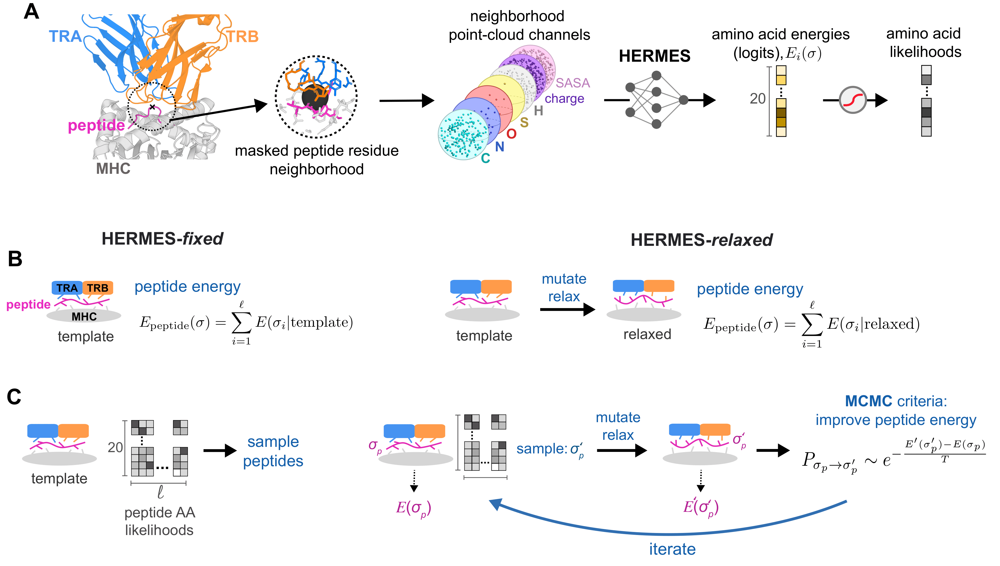
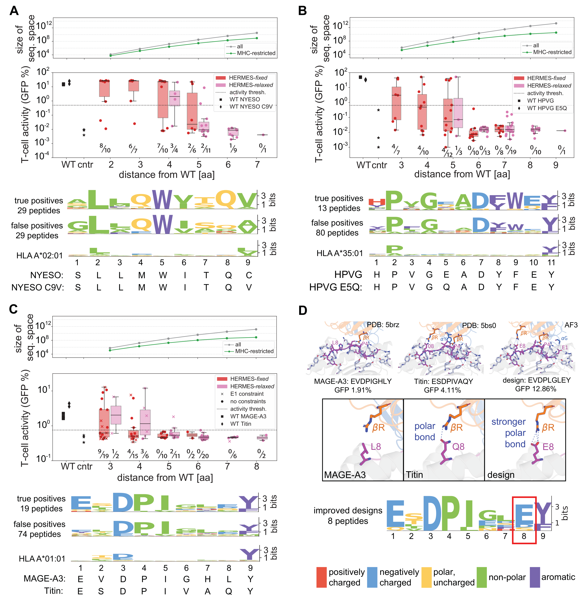
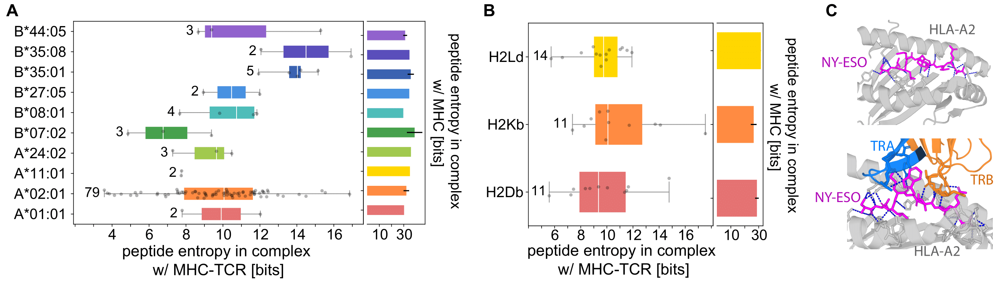

# T-cell receptor specificity landscape revealed through de novo peptide design

T-cells play a key role in adaptive immunity by mounting specific responses against diverse pathogens. An effective binding between  T-cell receptors (TCRs) and pathogen-derived peptides presented on Major Histocompatibility Complexes (MHCs) mediate an immune response. However, predicting these interactions remains challenging due to limited functional data on  T-cell reactivities. Here, we introduce a computational approach to predict TCR interactions with peptides presented on MHC class I alleles, and to design novel immunogenic peptides for specified TCR-MHC complexes. Our method leverages HERMES, a structure-based, physics-guided machine learning model trained on the protein universe to predict amino acid preferences based on local structural environments. Despite no direct training on TCR-pMHC data, the implicit physical reasoning in HERMES enables us to make accurate predictions of both TCR-pMHC binding affinities and T-cell activities across diverse viral epitopes and cancer neoantigens, achieving up to 72% correlation with experimental data. Leveraging our TCR recognition model, we develop a computational protocol for {de novo} design of immunogenic peptides. Through experimental validation in three TCR-MHC systems targeting viral and cancer peptides, we demonstrate that our designs---with up to five substitutions from the native sequence---activate T-cells at success rates of up to 50%. Lastly, we use our generative framework to quantify the diversity of the peptide recognition landscape for various TCR-MHC complexes, offering key insights into T-cell specificity in both humans and mice. Our approach provides a platform for immunogenic peptide and neoantigen design, opening new computational paths for T-cell vaccine development against viruses and cancer.

This repository contains data and code to generate the results in the paper "T-cell receptor specificity landscape revealed through de novo peptide design" by Visani G.M. et al.\\
The code is contingent upon the installation of the following three tools:
- HERMES (https://github.com/StatPhysBio/hermes)
- ProteinMPNN (fork with code to score and design peptides https://github.com/gvisani/ProteinMPNN-copy)
- TCRdock (fork with code to score peptides https://github.com/gvisani/TCRdock-copy)

## TCR-pMHC binding affinity and T-cell activity prediction

Code and benchmarking results of TCR-pMHC binding affinity prediction across different peptides can be found in `mutation_effects/nyeso` and `mutation_effects/tax`.\\
Code and benchmarking results of T-cell activity prediction across different peptides can be found in `mutation_effects/mskcc` and `mutation_effects/hsiue_et_al`.\\
Code for running HERMES-relaxed to score peptides can be found in `mutation_effects/src`.

## De-novo peptide design with in-vitro validation

If you're only looking for our HERMES-made peptide designs with in-vitro T-cell activity measurements, you can find them all in `peptide_designs/All-designs.xlsx`.

Scripts to generate peptides with different algorithms, benchmarking results (via TCRdock PAE), and post-in-vitro-experiment analysis can be found in `peptide_designs/nyeso`, `peptide_designs/ebv`, `peptide_designs/magea3_and_titin`.\\
Code for using HERMES-relaxed to design peptides can be found in `peptide_designs/src`. What is currently present is an older version of the code that is not well integrated with the HERMES repository, we will provide updated code soon.

## Quantifying the diversity of the TCR recognition landscape

We use the entropy of HERMES-fixed's predicted Position Weight Matrix of peptides to quantify the diversity of the TCR recognition landscape. Specifically, we compute peptide entropies conditioned on TCR-MHC structures using HERMES-fixed, and compare them to the entropies of the same peptides conditioned on the MHC only, grabbed from the MHC Motif Atlas (http://mhcmotifatlas.org/home).\\
Code and data can be found in `tcr_specificity`.

